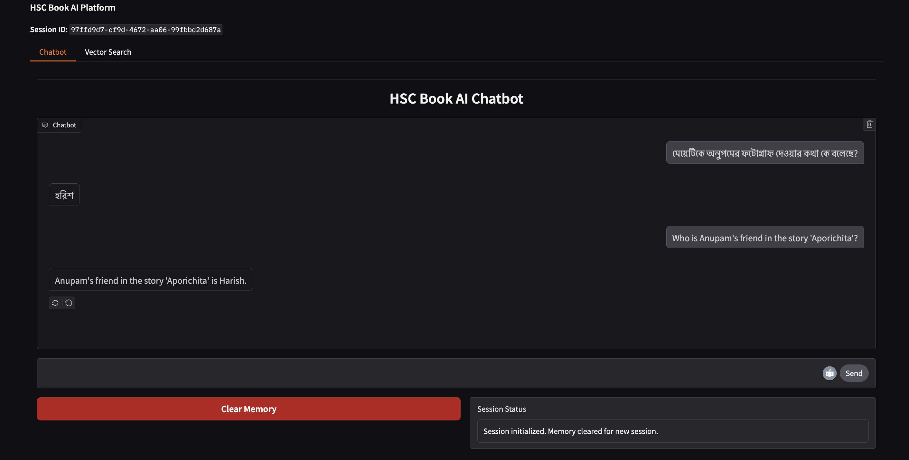
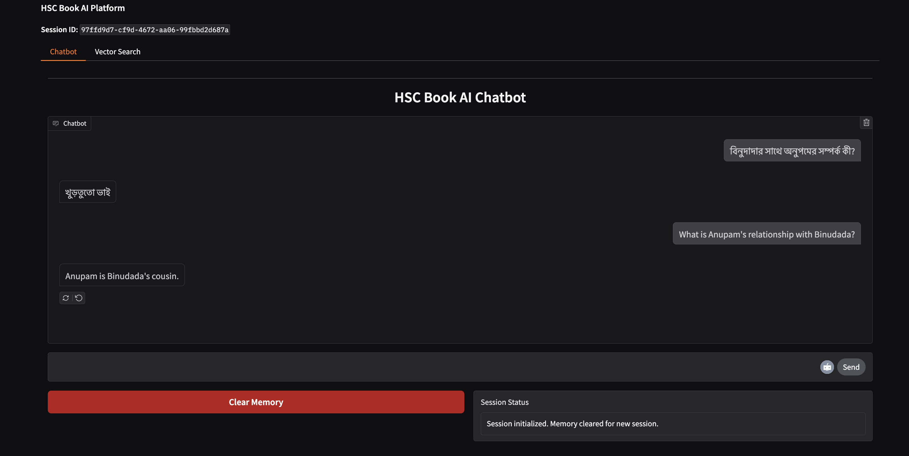
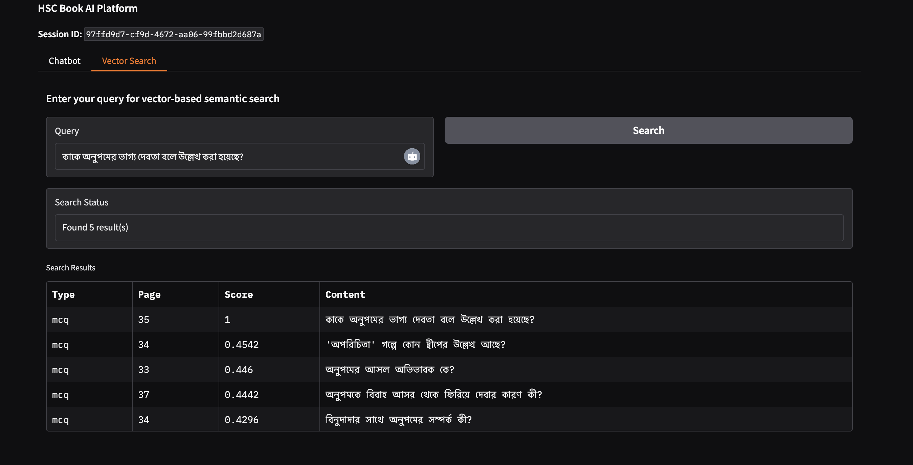
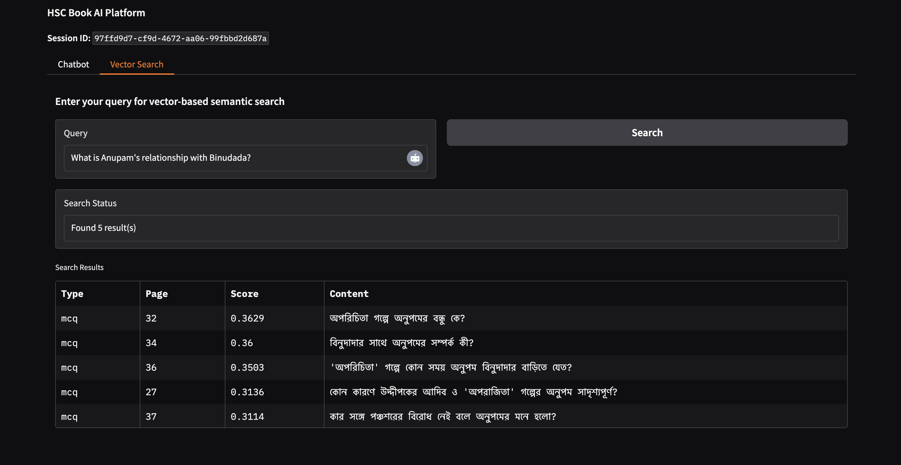
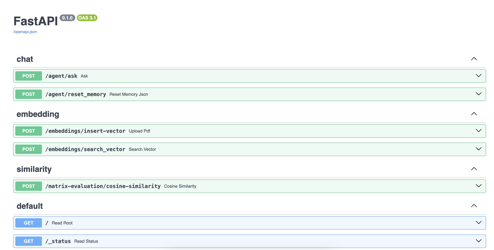

# HSC BOOK AI

## Setup Guide
* Python 3.12 or higher installed
* `pip` package manager

## Installation Steps
1. **Clone the repository**
```bash
git clone git clone https://github.com/shawonNirob/hsc-book-ai.git
or,
git clone git@github.com:shawonNirob/hsc-book-ai.git
cd hsc-book-ai
```

2. **Create and activate a virtual environment**
On Linux/macOS:
```bash
python3 -m venv book-env
source book-env/bin/activate
```

3. **Install dependencies**
```bash
pip install -r requirements.txt
```

7. **Environment Variables**
-Create a `.env` file and add your configuration:
```bash
OPENAI_API_KEY = " "
MODEL_ID =  "gpt-4o-2024-08-06"
QDRANT_API_KEY = " "
EMBEDDING_MODEL = "text-embedding-3-small"
```

4. **Run the FastAPI application**
```bash
uvicorn app.main:app --reload
```

5. **Access the API**
-Open your browser and go to:
```bash
http://127.0.0.1:8000
```

6. **Explore the interactive API docs**
* Swagger UI:
  `http://127.0.0.1:8000/docs`
* ReDoc:
  `http://127.0.0.1:8000/redoc`

## Used Tools, Libraries, and Packages

### Development Tools
- **Visual Studio Code**: Code editor used for development.

### Frameworks & Servers
- **FastAPI**: High-performance web framework for building APIs with Python.
- **Uvicorn**: ASGI server used to run the FastAPI app.

### Langchain Ecosystem
- **langchain**: Core Langchain framework for building LLM-based applications.
- **langchain_community**: Community integrations (e.g., vector stores, tools).
- **langchain_core**: Shared types and interfaces.
- **langchain_openai**: OpenAI integration for Langchain.

### AI and OCR
- **pytesseract**: Python wrapper for Google's Tesseract-OCR.
- **Pillow**: Imaging library used for image manipulation.
- **PyMuPDF**: PDF and document parsing.
- **langgraph**: Graph-based orchestration for LangChain components.

### Vector Database
- **Qdrant Client**: Client library for interacting with Qdrant, a vector similarity search engine.

### Data Validation
- **Pydantic**: Data validation using Python type hints.
- **pydantic-settings**: Manage application settings from `.env`.

### Utilities
- **Loguru**: Advanced logging for debugging and tracing.
- **requests**: HTTP requests for external APIs.
- **python-multipart**: Required by FastAPI to handle file uploads.

## Test Cases

- **অনুপমকে বিবাহ আসর থেকে ফিরিয়ে দেবার কারণ কী?**  
  গয়না নিয়ে মনোমালিন্যের কারণে

- **অনুপমের বাবা কী করে জীবিকা নির্বাহ করতেন?**  
  ওকালতি

- **অনুপম কাকে নিয়ে তীর্থযাত্রা শুরু করে?**  
  মাকে

- **Who is Anupam's friend in the story 'Aporichita'?**  
  Anupam's friend in the story 'Aporichita' is Harish.

- **In the story 'Aporichita', what color saree does Anupam imagine Kalyani wearing at her wedding?**  
  In the story 'Aporichita', Anupam imagines Kalyani wearing a red saree at her wedding.

## Screenshots

### Chatbot Interface



### Evaluation Matrix: Cosine Similarity API Response



## API Documentation

**Base URL:** `https://web-production-a06d.up.railway.app`

- **POST /agent/ask**  
  Accepts a query and optional thread ID. Returns a chatbot response.  
  Request body: `{ "query": "string", "thread_id": "string" }`

- **POST /agent/reset_memory**  
  Resets conversation memory for a given thread ID.  
  Request body: `{ "thread_id": "string" }`

- **POST /insert-vector**  
  Upload a PDF file; extracts chunks and inserts vectors into Qdrant.  
  Request: Multipart file upload.

- **POST /search_vector**  
  Search documents in Qdrant using a query string.  
  Request body: raw query string.

- **POST /matrix-evaluation/cosine-similarity**  
  Evaluation Matrix: Computes cosine similarity for the provided query.  
  Request body: `{ "query": "string" }`

## Screenshots
**API Documentation**: `https://web-production-a06d.up.railway.app/docs` or `https://web-production-a06d.up.railway.app/redoc`


## Follow Up Explanation

**1. What method or library did you use to extract the text, and why? Did you face any formatting challenges with the PDF content?**

I started by extracting text from PDFs using PyMuPDF, but it didn’t preserve the formatting well. So, I tried OCR with Tesseract and stored page by page in vector database, which didn’t organize the content clearly.  
Then, I used regex patterns to separate different parts like MCQs, creative questions, and notes. However, this wasn’t very reliable.  
Then, I brought in LLM to clean and group the text, which helped accuracy but sometimes caused errors for the bigger documents.  
So I use the mix solution, extract text page by page, then use the LLM to process each page separately. This balances accuracy and efficiency well, although some challenges with LLM limits still exist.  
For file handling, I currently read the entire PDF file as bytes in FastAPI, which makes processing flexible. For storing PDFs, MinIO is good for production.

**2. What chunking strategy did you choose (e.g. paragraph-based, sentence-based, character limit)? Why do you think it works well for semantic retrieval?**

I separated the content into specific blocks such as:  
- MCQ questions with separate answer keys.  
- MCQ questions with inline answers.  
- Creative questions.  
- Vocabulary and notes.  
- Main content.  
- Author information.  
- Path Porichiti.

This block based chunking, combined with page by page extraction, helps group related information meaningfully.  
It works well for semantic retrieval because each chunk is thematically focused, reducing noise and improving the relevance of search results. By keeping related content together, the vector search can better capture context and meaning, leading to more accurate and useful retrieval.

**3. What embedding model did you use? Why did you choose it? How does it capture the meaning of the text?**

I used the `text-embedding-3-small` multilingual model because it effectively captures both Bangla and English semantics. The model is fast but less accurate than `text-embedding-3-large`.  
There is other model `text-embedding-3-large` which generate 3072 dimensions vector, it is more accurate but it is slow and costly.  
It works by converting text into high-dimensional vectors (1536D) using a transformer-based architecture. The model captures contextual meaning by analyzing word relationships and sentence structure, allowing similar meanings across languages to map close together in vector space. This model works as semantic similarity for words and sentences with similar meanings to be positioned closer together in the vector space.

**4. How are you comparing the query with your stored chunks? Why did you choose this similarity method and storage setup?**

I use cosine similarity. Cosine similarity means how closer the sentence is in a dense vector space. Dot Product fails in high dimensions due to its magnitude and direction, while cosine similarity works well in high dimensions, it is about all comparisons are only based on direction, this eliminates the scale effect.  
I select Qdrant due to its high performance (RUST), and good for metadata filtering. It supports sparse vector and dense vector search, hybrid filtering, it is open source, easily can be used. Also, Qdrant provides optimized indexing structures (HNSW) that enable fast approximate nearest neighbor (ANN) searches.

**5. How do you ensure that the question and the document chunks are compared meaningfully? What would happen if the query is vague or missing context?**

The score has the cosine similarity, the more similarity result means more semantic. I used prompt enrichment, meaning prompt will send to LLM first for enrichment, if the prompt is vague then it will be corrected for better vector search result. Here is an example:  
user: বিয়ের সময় কল্যাণীর প্রকৃত বয়স কত ছিল?  
- ১৫ বছর  
user: তার বাবার নাম কি?  
Here the query will enrich like this `কল্যাণীর বাবার নাম কি?`, for better vector search.

**6. Do the results seem relevant? If not, what might improve them (e.g. better chunking, better embedding model, larger document)?**

Bangla works correctly, but sometimes when user asks in English that is not working correctly. That means more good multilingual model needed, which will perform based on the contextual meaning, not language dependent. Also, this problem occurs when vector result and query sent to LLM for response. Sometimes LLM hallucinate and based on user English query it provides response in Bangla. That can be solved by good prompt template. Also, data cleaning process is important here, paragraph can be separated by little chunk and store based on separate meaning so semantic search will work more accurately.